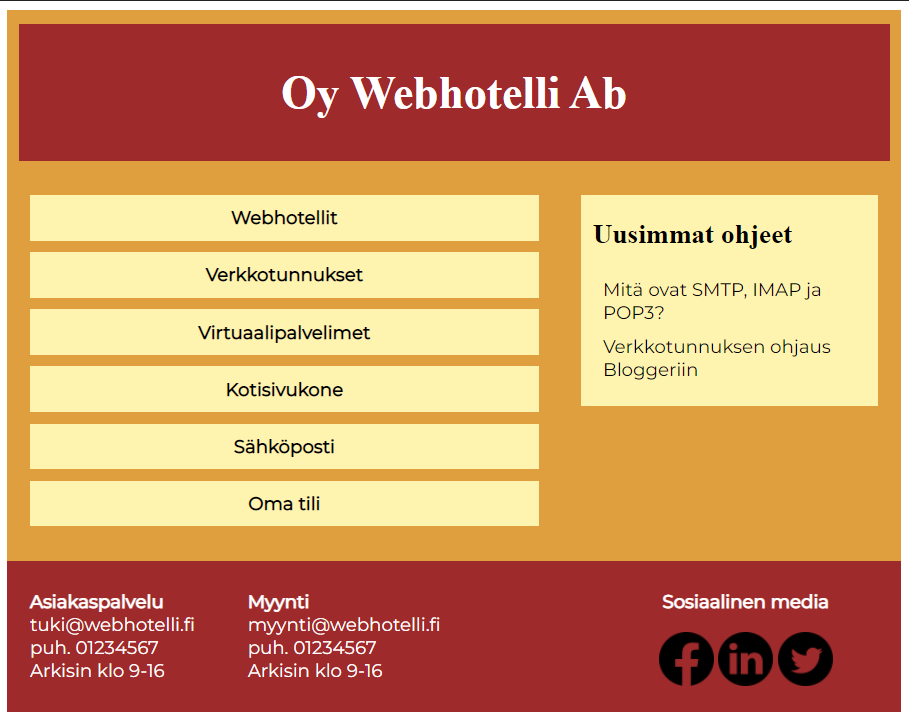
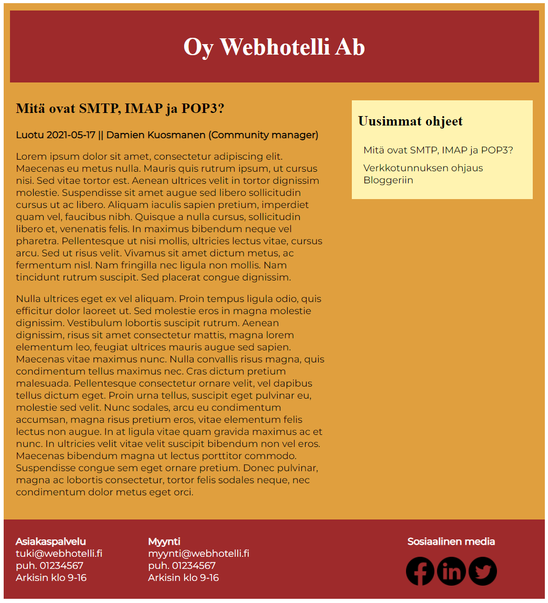

# Projekti

## Description 
PHP- and HTML5-based school project showcasing the customer side of a imaginary web hosting company. The website consists from a few different
articles. For the content, each article utilizes a pre-provided SQL-database located at localhost-server. Styling of the site
is done with a seperate CSS-file. The whole project is using a localhost-server, so you can't find it online. You need to
download it to your localhost - see chapter ***Installation***. The phone number and the email address found on page are both fake and for demonstration purposes only,
don't try to contact them - no one will respond.

The three PHP-pages are pretty similar - `index.php` is the frontpage, `kategoria.php` is the directory for different articles, and
`ohje.php` is the article itself. File `tietokanta.php` operates briefly only in the background, to provide a connection
to the database.

When the page is first loaded, `require_once ("tietokanta.php");` is executed first to attempt a connection with the
database. If there's an error, `die` is executed for the connection attempt, and an error message is shown for the user.

Important part of the project was to make it responsive - there's breakpoints for displays of different size at 600 pixels
and 800 pixels. This makes the UI better on smaller displays, like on a smartphone screen.

XAMPP was used to provide the local server for the project.

Link-icons for Facebook, Linkedin, and Twitter are free PNG-icons from [freeicons.io/](https://freeicons.io/). 

## Installation
The project is using SQL-database in localhost server. Here's how to create this database:

    1. Find the tukisivusto.sql -file from the folder tukisivusto-materiaalit/
    2. Copy everything from tukisivusto.sql
    3. Go to your localhost-admin. If using XAMPP, turn on Apache and MySQL modules using the XAMPP Control Panel. Admin page can be
       found from http://localhost/phpmyadmin/index.php
    4. On phpMyAdmin, click the tab called "SQL". Paste everything here that you copied earlier from tukisivusto.sql
    5. Click "GO" on the lower right corner of the typing field. The database for the website should now have been created

NOTE: tukisivusto.sql is made by third party, who is not updating it anymore, so I take no credit nor resbonsibility for it, 
if it doesn't work.

Other than the SQL, installation is very straightforward: download all the files inside folder etusivu/ , and if using XAMPP,
place them in C:\xampp\htdocs\projectname\.

## Screenshots

Front page
 
---
Article

## Authors

- [@BenkkuH](https://www.github.com/BenkkuH) 
- [@JohannnaM](https://www.github.com/JohannnaM) 

